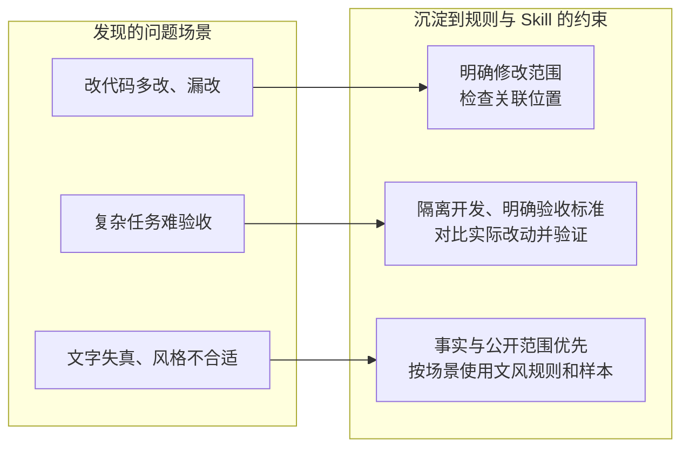

# GitHub 优秀项目研究索引

记录近期发现的优秀 GitHub 项目，围绕项目价值、运行体验、核心实现和可复用思路开展研究。每个子项目独立维护研究笔记、截图说明及可选的 Web 演示；本页只保留摘要与有序入口。

## 项目索引

按固定编号升序排列。编号从 `001` 开始，新增项目使用下一个编号，已分配编号不随研究状态变化，也不重复使用。

| 编号 | 项目 / 研究入口 | 原始仓库 | 摘要 | 状态 | Web 演示 |
| --- | --- | --- | --- | --- | --- |
| 001 | [Agents](projects/001-scarletkc-agents/README.md) | [scarletkc/agents](https://github.com/scarletkc/agents) | 从真实问题中沉淀规则、样本和检查，约束 AI 的工作与表达 | 已完成 | 暂无 |
| 002 | [Open-Magiviz](projects/002-open-magiviz/README.md) | [ItusiAI/Open-Magiviz](https://github.com/ItusiAI/Open-Magiviz) | 将外部模型串成 AI 视频创作产品；留作视频工作流参考，暂不深挖 | 已完成 | 暂无 |
| 003 | [Cola](projects/003-cola/README.md) | [官网与技能目录](https://cola.app/skills/zh/) | 借鉴 AI 产品能力组织方式，提取技能方法，经去重与实测后参考、使用和沉淀 | 已完成（概念研究） | 暂无 |
| 004 | [Awesome Grok Bot](projects/004-awesome-grok-bot/README.md) | [RongleCat/awesome-grok-bot](https://github.com/RongleCat/awesome-grok-bot) | 资料库介绍云端 AI 助手：托管云电脑执行任务，保存成果并复用流程 | 已完成（概念与源码结构研究） | 暂无 |

状态约定：`待研究` → `研究中` → `已完成`，暂时搁置使用 `已暂停`。

### 001 · Agents 概述

把 AI 协作中反复出现的问题，整理成规则与 Skill，供后续任务复用。



**值得借鉴：发现问题 → 沉淀经验 → 加入具体约束 → 在后续任务中检验。** 约束主要靠模型遵守，脚本仅检查部分表达。深入研究优先级低，遇到类似问题时查阅 [场景与约束](projects/001-scarletkc-agents/README.md#场景与约束) 即可。

### 003 · Cola 概述

[](projects/003-cola/README.md)

**产品层学习如何组织与交付 AI 能力；技能层提取专业规则、流程和模板，经验证后按需采用。** 本图为原创概念示意，非官方实现图；技能收录不等于效果已验证。

[研究与能力摘要](projects/003-cola/README.md) · [详细理解图](projects/003-cola/notes/architecture.md)

### 004 · Awesome Grok Bot 概述

[](projects/004-awesome-grok-bot/README.md)

**Grok Bot 是云端执行任务的 AI 产品；这个仓库是它的资料、案例和提示词目录。** 不需要把该仓库部署成助手；我们主要借鉴任务场景与可复用方法。本图为原创概念示意，非官方架构或实测结果。

[作用、能力与研究结论](projects/004-awesome-grok-bot/README.md)

## 目录导航

- [子项目目录](projects/README.md)：按编号组织的研究资料。
- [子项目模板](templates/project/README.md)：项目摘要、复现记录、研究结论及截图入口。
- [维护指南](guides/CONTRIBUTING.md)：新增项目、编号和图片规范。
- [Web 部署指南](guides/DEPLOYMENT.md)：多个演示的目录、路径和发布方式。
- [站点首页源文件](docs/index.html)：为后续 GitHub Pages 演示准备的入口，尚未启用发布。

```text
projects/                    # 研究子项目：001-slug、002-slug……
  001-project-name/          # 结构示意，尚未创建真实项目
    README.md               # 摘要、原仓库、结论和导航
    notes/                  # 研究笔记、复现记录
    assets/                 # 截图与图片说明
    demo/                   # 可选：演示源码
templates/project/          # 可复制的研究模板，不占编号
docs/                       # GitHub Pages 静态发布目录
  demos/                    # 各演示的静态文件
guides/                     # 维护与部署说明
```

研究记录应注明上游仓库、研究版本或 commit、研究日期。引用的代码与图片保留原作者及许可证信息；第三方项目遵循各自的许可证。
