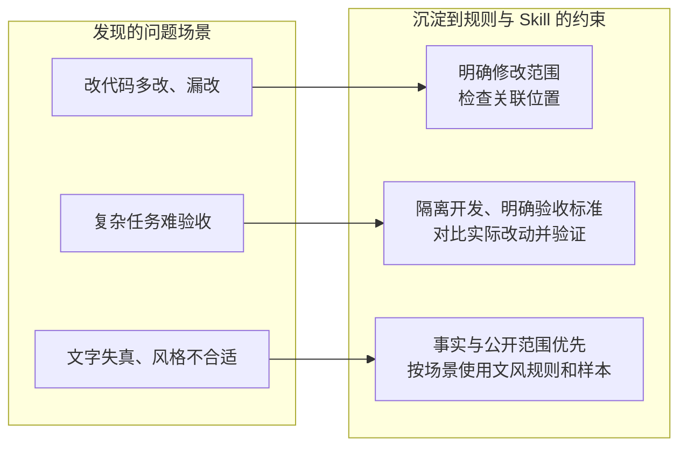
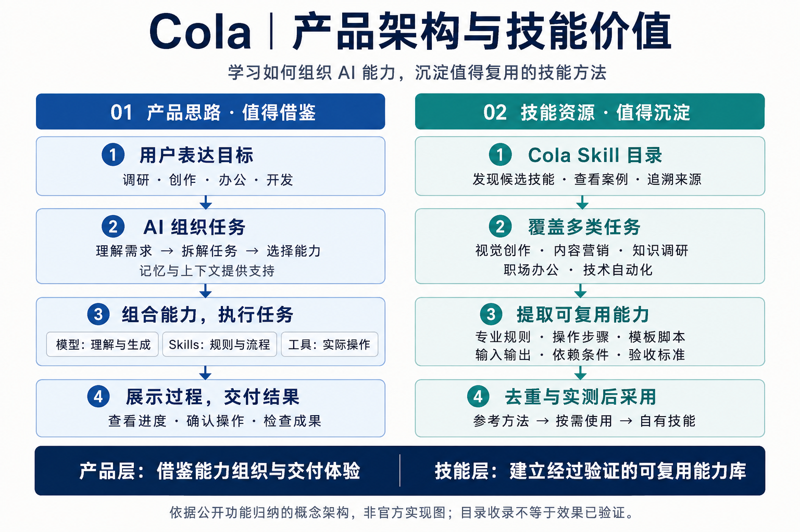
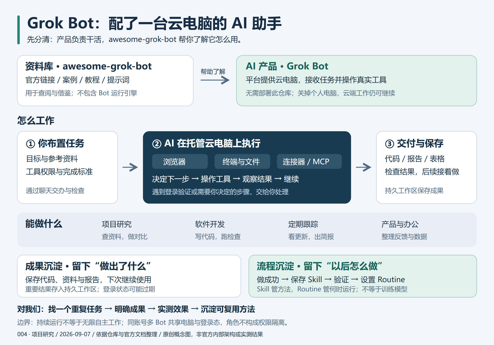
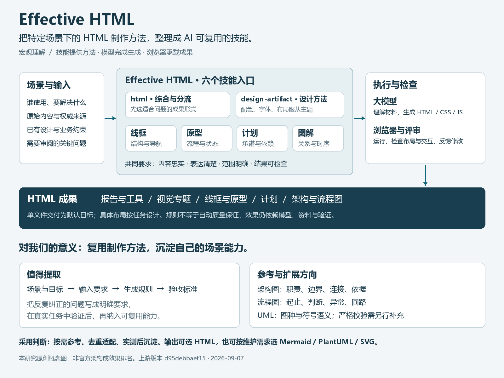
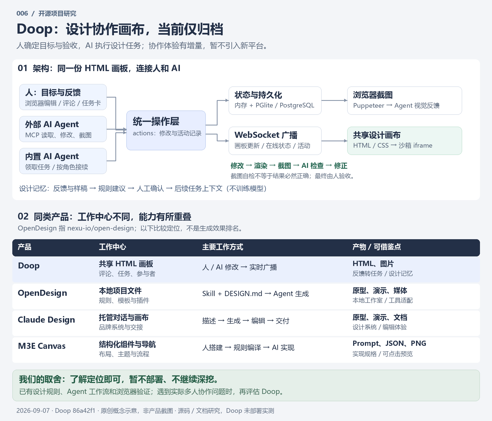
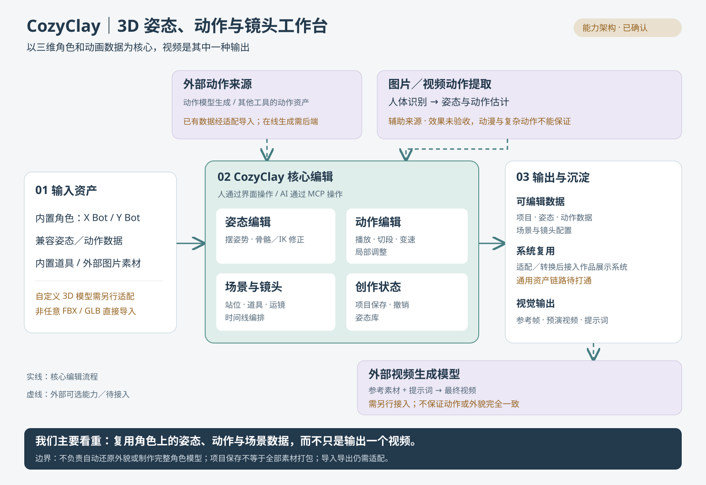

# GitHub 优秀项目研究索引

记录近期发现的优秀 GitHub 项目，围绕项目价值、运行体验、核心实现和可复用思路开展研究。每个子项目独立维护研究笔记、截图说明及可选的 Web 演示；本页只保留摘要与有序入口。

## 项目索引

按固定编号升序排列。编号从 `001` 开始，新增项目使用下一个编号，已分配编号不随研究状态变化，也不重复使用。

| 编号 | 项目 / 研究入口 | 原始仓库 | 摘要 | 状态 | Web 演示 |
| --- | --- | --- | --- | --- | --- |
| 001 | [Agents](projects/001-scarletkc-agents/README.md) | [scarletkc/agents](https://github.com/scarletkc/agents) | 从真实问题中沉淀规则、样本和检查，约束 AI 的工作与表达 | 已完成 | 暂无 |
| 002 | [Open-Magiviz](projects/002-open-magiviz/README.md) | [ItusiAI/Open-Magiviz](https://github.com/ItusiAI/Open-Magiviz) | 将外部模型串成 AI 视频创作产品；留作视频工作流参考，暂不深挖 | 已完成 | 暂无 |
| 003 | [Cola](projects/003-cola/README.md) | [官网与技能目录](https://cola.app/skills/zh/) | 借鉴 AI 产品能力组织方式，提取技能方法，经去重与实测后参考、使用和沉淀 | 已完成（概念研究） | 暂无 |
| 004 | [Awesome Grok Bot](projects/004-awesome-grok-bot/README.md) | [RongleCat/awesome-grok-bot](https://github.com/RongleCat/awesome-grok-bot) | 资料库介绍云端 AI 助手：托管云电脑执行任务，保存成果并复用流程 | 已完成（概念与源码结构研究） | 暂无 |
| 005 | [Effective HTML](projects/005-effective-html/README.md) | [plannotator/effective-html](https://github.com/plannotator/effective-html) | 面向场景的 HTML 生成技能；借鉴输入、生成规则与验收标准，沉淀可复用能力 | 已完成（规则、演示与价值整理） | [六技能场景演示](https://yydshly.github.io/0907_codex_project/demos/005-effective-html/showcase.html) |
| 006 | [Doop](projects/006-doop/README.md) | [kgoedecke/doop](https://github.com/kgoedecke/doop) | 人与 AI 共用设计画布；与已有设计流程重叠，当前仅归档、暂不深挖 | 已完成（源码与对比归档） | 暂无 |
| 007 | [CozyClay](projects/007-cozyclay/README.md) | [NomaDamas/CozyClay](https://github.com/NomaDamas/CozyClay) | 浏览器三维分镜与动作预演；实测动作播放、场景搭建及 MCP 自动构图 | 已完成（本地工作台与 MCP 实测） | [中文能力导览](https://yydshly.github.io/0907_codex_project/demos/007-cozyclay/index.html) |
| 008 | [Visual Memory Translator](projects/008-visual-memory-translator/README.md) | [TanShilongMario/visual-memory-translator-SKILL](https://github.com/TanShilongMario/visual-memory-translator-SKILL) | 照片与文本的视觉转译技能；借鉴审美规则、风格选择与失败修正方法 | 已完成（简单记录，暂不深入） | [中文能力展示](https://yydshly.github.io/0907_codex_project/demos/008-visual-memory-translator/index.html) |
| 009 | [UX/UI Agent Skills](projects/009-ux-ui-agent-skills/README.md) | [plugin87/ux-ui-agent-skills](https://github.com/plugin87/ux-ui-agent-skills) | 设计知识、主题 Token、组件规范与实际页面检查；借鉴可复用的设计与验证流程 | 已完成（能力整理与原始示例体验；生成效果未实测） | [能力导览](https://yydshly.github.io/0907_codex_project/demos/009-ux-ui-agent-skills/index.html) · [真实示例](https://yydshly.github.io/0907_codex_project/demos/009-ux-ui-agent-skills/effects.html) |

状态约定：`待研究` → `研究中` → `已完成`，暂时搁置使用 `已暂停`。

### 001 · Agents 概述

把 AI 协作中反复出现的问题，整理成规则与 Skill，供后续任务复用。



**值得借鉴：发现问题 → 沉淀经验 → 加入具体约束 → 在后续任务中检验。** 约束主要靠模型遵守，脚本仅检查部分表达。深入研究优先级低，遇到类似问题时查阅 [场景与约束](projects/001-scarletkc-agents/README.md#场景与约束) 即可。

### 003 · Cola 概述

[](projects/003-cola/README.md)

**产品层学习如何组织与交付 AI 能力；技能层提取专业规则、流程和模板，经验证后按需采用。** 本图为原创概念示意，非官方实现图；技能收录不等于效果已验证。

[研究与能力摘要](projects/003-cola/README.md) · [详细理解图](projects/003-cola/notes/architecture.md)

### 004 · Awesome Grok Bot 概述

[](projects/004-awesome-grok-bot/README.md)

**Grok Bot 是云端执行任务的 AI 产品；这个仓库是它的资料、案例和提示词目录。** 不需要把该仓库部署成助手；我们主要借鉴任务场景与可复用方法。本图为原创概念示意，非官方架构或实测结果。

[作用、能力与研究结论](projects/004-awesome-grok-bot/README.md)

### 005 · Effective HTML 概述

[](projects/005-effective-html/README.md)

**核心是用技能指导 HTML 成果生成；我们借鉴的是“场景与目标 → 输入要求 → 生成规则 → 验收标准”的组织方法。** 可按需沉淀架构图、流程图、计划和原型能力；严格 UML 规范与校验需要补充。图为原创概念引导，非官方架构或效果排名。

[核心能力、意义与参考价值](projects/005-effective-html/README.md) · [六技能场景演示](https://yydshly.github.io/0907_codex_project/demos/005-effective-html/showcase.html)

### 006 · Doop 概述

[](projects/006-doop/README.md)

**人确定目标与验收，AI 完成设计任务；Doop 改善实时协作体验，当前对我们的新增价值有限。** 仅做记录，暂不部署、不继续深挖。本图为原创架构与定位示意，非产品截图或效果排名。

[研究结论、架构与产品对比](projects/006-doop/README.md)

### 007 · CozyClay 概述

[](projects/007-cozyclay/README.md)

**核心是编辑和复用兼容三维角色上的姿态、动作、场景与镜头数据，视频是其中一种输出。** 已有动作可经适配导入；自定义三维模型与系统复用链路需另行适配。图片／视频动作提取效果尚未验收，外部视频生成需接入。本图为经讨论确认的原创能力引导，非官方架构或全部功能的实测证明。

[能力范围与研究结论](projects/007-cozyclay/README.md) · [源码核对依据](projects/007-cozyclay/notes/capability-boundaries.md) · [中文能力导览](https://yydshly.github.io/0907_codex_project/demos/007-cozyclay/index.html)

### 008 · Visual Memory Translator 概述

**将照片和句子转译为艺术出版气质的视觉作品，核心是把审美判断组织成 AI 可复用的技能规则。** 支持风格预览、文本隐喻与多种视觉载体；生成依赖外部模型，坐标锁定、原图保真与质量检查尚无程序保证。照片路径可概括为“关键元素提取 → 艺术化简化 → 重新构图”。仅简单记录并保留展示，暂不深入研究，生图未实测。

[能力、原理与研究结论](projects/008-visual-memory-translator/README.md) · [源码依据与能力边界](projects/008-visual-memory-translator/notes/capability-boundaries.md) · [中文能力展示](https://yydshly.github.io/0907_codex_project/demos/008-visual-memory-translator/index.html)

### 009 · UX/UI Agent Skills 概述

[](projects/009-ux-ui-agent-skills/README.md)

**核心是把“界面长什么样、怎样操作、如何检查”组织成 AI 可遵循的规范。** 视觉约束统一风格、按钮和主题；交互要求规定排序、选择、加载与确认行为；标准要求覆盖可读性、键盘和语义。依据包括公开标准、设计方法与作者经验，不能全部视为强制标准。当前按需参考，整套接入优先级低；六个原始示例已体验，但未证明相对强模型的生成增益。本图为原创研究引导，非官方架构或效果认证。

[能力与研究结论](projects/009-ux-ui-agent-skills/README.md) · [标准与技能关系](https://yydshly.github.io/0907_codex_project/demos/009-ux-ui-agent-skills/standards.html) · [六个原始示例](https://yydshly.github.io/0907_codex_project/demos/009-ux-ui-agent-skills/effects.html)

## 目录导航

- [子项目目录](projects/README.md)：按编号组织的研究资料。
- [子项目模板](templates/project/README.md)：项目摘要、复现记录、研究结论及截图入口。
- [维护指南](guides/CONTRIBUTING.md)：新增项目、编号和图片规范。
- [Web 部署指南](guides/DEPLOYMENT.md)：多个演示的目录、路径和发布方式。
- [站点首页源文件](docs/index.html)：GitHub Pages 站点入口，已配置 main 分支的 /docs 自动发布。

```text
projects/                    # 研究子项目：001-slug、002-slug……
  001-project-name/          # 结构示意，尚未创建真实项目
    README.md               # 摘要、原仓库、结论和导航
    notes/                  # 研究笔记、复现记录
    assets/                 # 截图与图片说明
    demo/                   # 可选：演示源码
templates/project/          # 可复制的研究模板，不占编号
docs/                       # GitHub Pages 静态发布目录
  demos/                    # 各演示的静态文件
guides/                     # 维护与部署说明
```

研究记录应注明上游仓库、研究版本或 commit、研究日期。引用的代码与图片保留原作者及许可证信息；第三方项目遵循各自的许可证。
