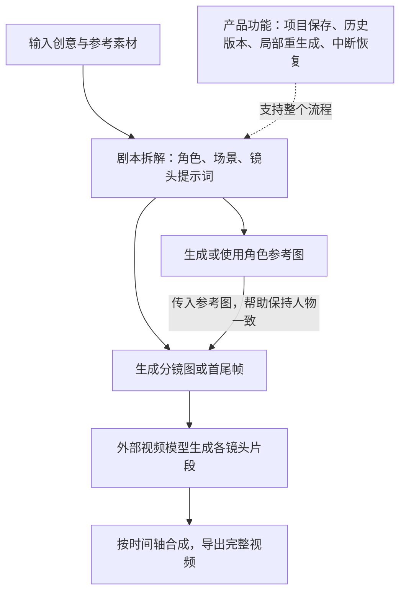

# 002 · Open-Magiviz

把外部大模型的视频制作能力串成完整创作产品，保留为未来开发视频工作流时的参考。

| 项目 | 内容 |
| --- | --- |
| 原始仓库 | [ItusiAI/Open-Magiviz](https://github.com/ItusiAI/Open-Magiviz) |
| 研究版本 | [`38ea70e`](https://github.com/ItusiAI/Open-Magiviz/tree/38ea70ec218d4d17caad30888779b1bb2935c0e2) |
| 研究日期 | 2026-09-07 |
| 状态 | 已完成（简要研究，暂不深挖） |
| 验证范围 | 阅读说明及核心代码；未部署，未调用付费模型验证成片效果 |
| 上游许可证 | 当前版本未找到明确 LICENSE 文件或许可证声明 |

## 能力一图

本图为本次研究依据上游代码整理的能力示意图，非产品截图；绘制日期：2026-09-07。

## 这个库能做什么

从文字创意和参考素材出发，生成剧本、角色图、分镜及视频片段，再合成为完整视频。用户可以分步查看和修改结果，保存项目、追溯版本，并继续未完成的制作任务；同时配有登录、积分、订阅等产品功能。

内部主要是提示词组织、外部模型接口调用和流程状态管理。角色图被传给分镜生成，分镜再用于视频生成，以此帮助保持人物和画面一致性；效果仍依赖模型，未看到独立的一致性算法。最终片段通过 FAL 的 FFmpeg 接口合成。

## 我们的判断

这是 AI 视频创作产品的源码展示与推广入口：README 包含在线产品入口、赞助和专属注册链接。核心是将视频制作逻辑产品化，价值集中在流程和使用细节，并非底层模型创新。

对当前研究目标，新增学习价值有限，暂不继续深挖。以后实际开发视频工作流时，再参考角色与分镜之间的素材传递、局部重生成和失败恢复机制。

## 代码入口

- [剧本拆解](https://github.com/ItusiAI/Open-Magiviz/blob/38ea70e/app/api/ai/generate-story-details/route.ts)：把创意转成角色、场景和各阶段提示词。
- [分镜生成](https://github.com/ItusiAI/Open-Magiviz/blob/38ea70e/app/api/ai/generate-storyboard-image/route.ts)：传递角色参考图及首尾帧信息。
- [流程控制](https://github.com/ItusiAI/Open-Magiviz/blob/38ea70e/components/operate.tsx)：分步生成、修改、恢复和版本关联。
- [视频合成](https://github.com/ItusiAI/Open-Magiviz/blob/38ea70e/app/api/ai/fal/compose-story-video/route.ts)：按时间轴拼接片段。

[返回总索引](../../README.md)
