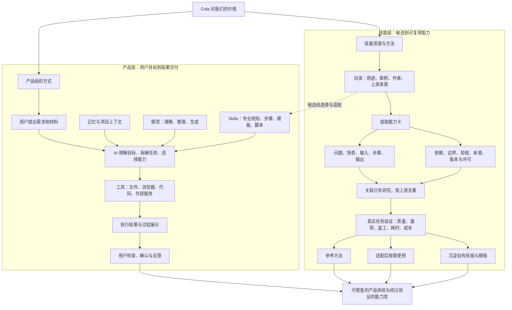

# Cola 详细理解图

概念架构依据公开功能归纳，不代表已核实的内部实现。首页概述图用于快速回忆；本图用于进一步理解分工。

```mermaid
flowchart TB
    A[Cola 对我们的价值] --> P[产品组织方式]
    A --> S[技能资源与方法]
    subgraph product[产品层：用户目标到结果交付]
      P --> U[用户提出需求和材料]
      U --> O[AI 理解目标、拆解任务、选择能力]
      M[记忆与项目上下文] --> O
      L[模型：理解、推理、生成] --> O
      K[Skills：专业规则、步骤、模板、脚本] --> O
      O --> T[工具：文件、浏览器、代码、外部服务]
      T --> R[执行结果与过程展示]
      R --> F[用户检查、确认与反馈]
    end
    subgraph skills[技能层：候选到可复用能力]
      S --> C[目录：用途、案例、作者、上游来源]
      C --> D[提取能力卡]
      D --> D1[问题、场景、输入、步骤、输出]
      D --> D2[依赖、边界、验收、来源、版本与许可]
      D1 --> E[关联已有研究，按上游去重]
      D2 --> E
      E --> V[真实任务验证：质量、漏项、返工、耗时、成本]
      V --> V1[参考方法]
      V --> V2[适配后按需使用]
      V --> V3[沉淀自有技能与模板]
    end
    C -.候选经选择与适配.-> K
    F --> W[可借鉴的产品体验与经过验证的能力库]
    V1 --> W
    V2 --> W
    V3 --> W
```

[返回研究页与来源说明](../README.md)
