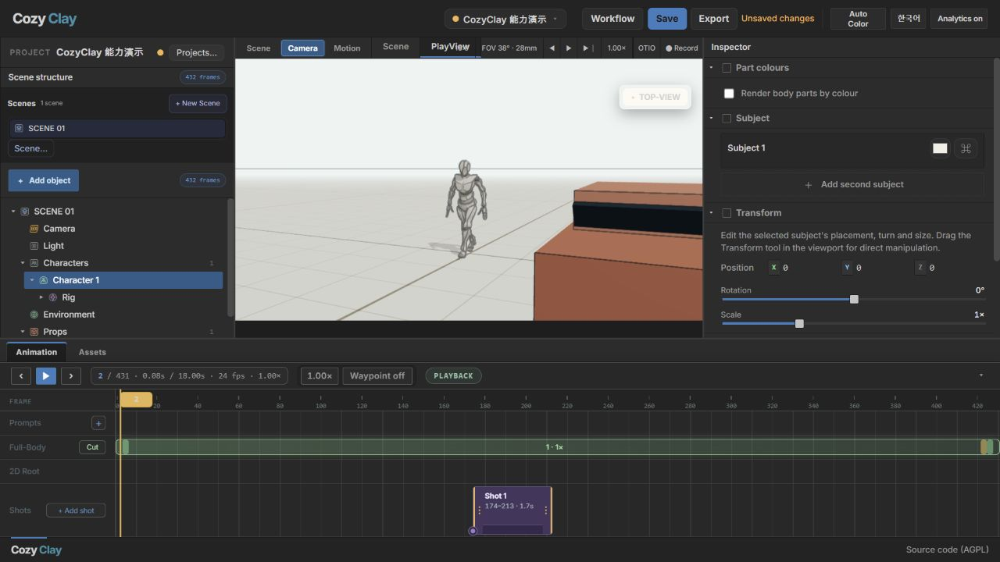

# 007 · CozyClay

> 浏览器端三维分镜与动作预演：组织人物、道具、动作和摄影机，并允许 AI 通过 MCP 操作同一个项目。

| 项目 | 内容 |
| --- | --- |
| 上游 | [NomaDamas/CozyClay](https://github.com/NomaDamas/CozyClay) |
| 研究版本 | 1.7.0 / `cf78a39b171419ac567662e0932a5c563ed4a47b` |
| 研究日期 | 2026-09-07 |
| 状态 | 已完成（本地工作台与 MCP 实测；GPU 生成未配置） |
| 技术栈 | React、React Three Fiber、Three.js、Vite、Node.js、MCP |
| 上游许可 | [AGPL-3.0-or-later](https://github.com/NomaDamas/CozyClay/blob/main/LICENSING.md)，第三方资产与模型另有许可 |
| 源码位置 | `../../upstream/cozyclay`，独立 Git 仓库，不纳入研究仓库提交 |
| 中文导览 | [导览文件](../../docs/demos/007-cozyclay/index.html) · [本地页面](http://127.0.0.1:5187/demos/007-cozyclay/) |
| 原版工作台 | [打开并加载示例动作](http://127.0.0.1:5180/app/?motion=/demo/walk-then-stop.npz) |

## 能力架构

[](../../docs/demos/007-cozyclay/architecture.html)

本图为经讨论确认的原创能力架构说明，非产品截图。核心价值是编辑、组织并复用兼容角色上的姿态、动作、场景和镜头数据；视频是其中一种输出。

| 来源或产物 | 确认的范围 |
| --- | --- |
| 三维角色 | 当前内置 X Bot / Y Bot；自定义模型需另行适配，未确认任意 FBX/GLB 直接导入 |
| 已有动作资产 | Motion Input 支持本地文件或 URL；需符合内部骨架和数据约定，导入已有数据不要求运行生成后端 |
| 其他模型/工具的动作输出 | 可作为适配来源；已有特定骨架转换实现，不代表所有来源通用兼容 |
| 在线生成新动作 | 需配置 Kimodo 等对应后端；生成的是骨骼运动，不是最终视频 |
| 图片/视频提取 | 已有实现，效果未验收；动漫、遮挡和复杂动作不能保证 |
| 数据沉淀 | 项目、姿态、动作数据及镜头配置；项目文件不等于全部素材打包 |
| 对接作品展示系统 | 通用格式导出、骨架适配与系统播放链路仍需打通 |
| 外部视频生成 | 提供参考素材和提示词；自动提交与回流需另行接入，不保证动作与外貌一致 |

[能力边界与源码依据](notes/capability-boundaries.md)

## 已交付与验证

- 原版依赖安装成功，工作台启动于本机 5180 端口。
- 创建“CozyClay 能力演示”，加载官方 `walk-then-stop.npz`：432 帧、24 fps、18 秒。
- 实际播放、暂停并跳转时间线；添加 Car 道具并编辑位置；切换 Wide 镜头，添加 Shot 1，进入 PlayView。
- MCP 连接实际编辑器，调用 `frame_shot` 得到全景、右前侧面、平视、35mm；`describe_shot` 回读相同结果，人物占画面高度 41%，距离 7.59m。
- `save_project` 写入 [演示项目](capability-demo.cclayproject)，[原始验证记录](mcp-verification.json)可查。演示脚本退出后断开 MCP，工作台仍可使用。
- 中文导览与原版界面经过浏览器查看；没有运行或宣称通过完整上游测试套件。



截图来源：本机运行上游原版工作台，2026-09-07；摄于 MCP 自动构图之前。官方演示视频从本地上游源码服务播放，不作为本次生成结果。

## 运行与复现

环境：Windows、Node.js 22.15.0、npm 10.9.2、Chromium。此机器已完成获取与安装。其他机器首次获取时在研究仓库根目录执行：

```powershell
git clone https://github.com/NomaDamas/CozyClay.git upstream/cozyclay
git -C upstream/cozyclay checkout cf78a39b171419ac567662e0932a5c563ed4a47b
```

再次启动：

```powershell
powershell -NoProfile -File projects/007-cozyclay/start.ps1
```

启动器后台打开工作台（5180）与导览（5187），仅监听 `127.0.0.1`。端口占用时不终止已有服务，需确认服务归属。日志放在子项目目录并由总仓库忽略。

体验路径：打开导览 → 原版工作台 → 若出现首次项目选择器则新建项目 → 再点击带 `motion` 参数的工作台链接。底部 ▶ 播放，FRAME 时间尺定位，Camera 调整镜头，PlayView 查看画面。

恢复本次布置：从工作台项目菜单打开 `capability-demo.cclayproject`。本次 MCP 保存结果包含人物、汽车和镜头段，`motionRef` 为空，不包含示例动作引用；打开项目后，再访问上方带 `motion` 参数的工作台链接重新加载动作。MCP 构图回读结果记录的是当时的实时相机，保存的 Shot 1 仍保留之前通过 UI 创建的 28mm 镜头关键帧。

MCP 演示复现（先打开编辑器，仅保留一个 CozyClay 编辑器标签页，5184 端口需空闲）：

```powershell
npm --prefix upstream/cozyclay/mcp ci --no-audit --no-fund
node projects/007-cozyclay/mcp-demo.mjs
```

脚本启动临时 stdio MCP 服务，等待编辑器连接，改变当前镜头并覆盖本子项目的演示项目与验证记录。

## 原理、场景与研究结论

- **空间编辑**：React Three Fiber/Three.js 渲染人物和道具的共享三维场景。
- **镜头语义**：`src/shot.js` 根据距离、朝向、视场角和传感器参数计算摄影术语；MCP 反解目标景别的机位。
- **动作管线**：默认外部 Kimodo 后端，77 关节骨架转换为编辑器的 27 关节表示，通过 IK 与时间线修正。
- **人机共编**：MCP 经 WebSocket 调用在线编辑器，UI 与 AI 共享核心模型并回读实际状态。
- **可保存创作**：项目保存创作状态，部分素材通过引用加载；生成配方记录 seed、提示词和修改序列。

适合 AI 短片前置控制、导演沟通、摄影教学和游戏过场原型。对我们最值得借鉴的是结构化创作状态、明确工具接口、操作后回读与撤销机制。

与 002 Open-Magiviz 可形成潜在衔接：CozyClay 偏生成前的三维控制，视频平台偏模型编排与交付；尚未实际集成。

扩展建议：模型提交与结果回流 → 统一镜头素材包 → 构图/遮挡检查 → 角色与镜头模板 → 协作审阅。建议用同一组三镜头比较“直接提示词”和“先预演再生成”的返工次数、构图遵循度与耗时。

## 能力边界

- 本次使用预生成动作，没有配置或验证 GPU 生成、局部重生成与轨迹编辑效果。
- MP4 导出、OTIO、IK 等有实现入口，本次未逐一验收，不标记为实测通过。
- Workflow 本地执行器主要传递和转换数据，不代表完整外部视频生成流水线。
- 深度/法线镜头包与共享项目有设计提案，提案不等于已交付能力。
- 修改后的网络服务需遵循上游 AGPL 源码提供要求；第三方模型、权重、素材许可单独检查。

[返回总索引](../../README.md)
