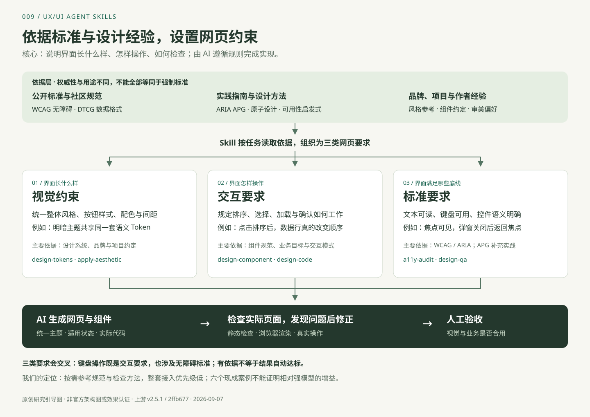

# 009 · UX/UI Agent Skills

> 将设计知识、组件规范和检查工具组织成 AI 可执行的工作流程；重点借鉴统一设计语言与验证实际产物的方法。

| 项目 | 内容 |
| --- | --- |
| 编号 | 009 |
| 原始仓库 | [plugin87/ux-ui-agent-skills](https://github.com/plugin87/ux-ui-agent-skills) |
| 官方说明 | [README](https://github.com/plugin87/ux-ui-agent-skills/blob/2ffb677aa02b225c8a3da1b7f31d9ebb7c38f1dd/README.md) |
| 研究版本 | package.json：`2.5.1`；提交：`2ffb677aa02b225c8a3da1b7f31d9ebb7c38f1dd` |
| 研究日期 | 2026-09-07 |
| 状态 | 已完成（能力整理与六个原始示例体验；新需求生成效果未实测） |
| 技术构成 | Markdown 指令与知识、JSON Token、Node 安装器与浏览器检查、Python 静态检查 |
| 上游许可证 | package.json 声明 MIT；本次检出的根目录未见独立 LICENSE 文件，复用源码前应核对许可正文 |
| Web 演示 | [中文能力导览](https://yydshly.github.io/0907_codex_project/demos/009-ux-ui-agent-skills/index.html)（GitHub Pages 在线展示） |

## 项目定位

本图为原创研究引导，非官方架构或效果认证。[图片说明](assets/README.md)

| 要求类型 | 解释与例子 | 主要依据 |
| --- | --- | --- |
| 视觉约束 | 界面长什么样：统一整体风格、按钮样式、配色、间距和主题 | 设计系统、品牌参考、项目约定与审美经验 |
| 交互要求 | 界面怎样操作：排序真的改变行顺序、选择联动、加载避免重复操作、弹窗可取消 | 组件规范、业务目标和交互模式 |
| 标准要求 | 界面满足什么底线：文本可读、键盘可用、焦点可见、控件语义明确 | WCAG / ARIA；APG 提供实践指导 |

三类要求可以交叉，不是互斥分类。DTCG 主要规范 Token 数据表达，不直接规定页面美学；品牌参考和作者偏好也不能等同于公开标准。库的作用是把依据转成可遵循的工作规范，其实际收益仍取决于任务与模型表现。

这是供 AI 读取的设计知识与执行规范集合，包含可运行的辅助检查脚本。它不提供新的设计模型，也不是直接导入即可使用的完整 UI 组件库。宿主 AI 根据需求读取规范、生成代码、调用工具，并根据结果修改。

它最有价值的部分是把“设计得好一些”拆成具体要求：统一颜色和间距、覆盖适用的交互状态、遵守无障碍规范、检查真实页面，再由人判断视觉和业务效果。

## 核心能力与边界

| 能力 | 实际内容 | 边界 |
| --- | --- | --- |
| 设计基础与主题 | DTCG 风格 JSON Token；颜色、字体、间距、圆角、动效；明暗及多品牌规则 | 默认主题需要结合实际产品调整 |
| 组件与页面 | 组件结构、变体、状态、Token 映射、无障碍和页面布局规范 | 规范由模型转为代码，不是完整成品组件包 |
| 多框架实现 | React、Vue、SwiftUI 等适配文档；统一的框架适配协议 | 缺失适配由模型补写，不能推导出所有框架效果一致 |
| 视觉风格 | 实际含 138 个品牌风格目录及审美规则 | 属于品牌启发的参考，不等于官方设计系统 |
| 截图转代码 | 从截图提炼布局、颜色和排版，建立主题并重建页面 | 不保证像素级还原 |
| 审查与改版 | 设计评审、无障碍审查、文案、原型与改版流程 | 不能代替用户访谈与业务验证 |
| 自动验证 | Token 引用、部分对比度、响应式、键盘和状态行为检查 | 只覆盖指定目标与已实现检查，不是全面合格证明 |
| 设计协作 | Figma Variables 映射、Token 构建、版本治理指南 | 需要外部工具、连接和具体工程实现 |

本次核对有 17 个技能目录。完整清单见 [能力目录](notes/capabilities.md)。数量以该提交的目录为准，上游介绍中的部分统计尚未同步。

## 底层原理

本图为根据源码整理的概念流程，不是官方架构图或运行结果。

1. **任务路由：** `CLAUDE.md` 用表格将需求映射到文件和技能。由模型理解并读取相关内容，仓库未提供独立的智能路由服务。
2. **分层知识：** 常用原则位于入口，详细规则和领域知识按需读取，减少无关上下文。
3. **统一表达：** 原始 Token → 语义 Token → 组件 Token。例如按钮背景引用“主要操作色”，后者引用原始色值。主题调整集中在映射层。
4. **框架适配：** 明确主题、组件属性、样式、明暗模式、动效在目标框架中的表达方式，再由模型生成实现。
5. **反馈修正：** 用脚本和真实渲染检查发现部分问题，并要求修复；主观审美及业务是否合用仍需单独判断。

## 场景与对我们的意义

| 场景 | 可借鉴内容 | 我们需要补充 |
| --- | --- | --- |
| 产品原型与新页面 | 先确定主题，再设计组件和页面 | 真实需求、内容和优先级 |
| 后台与 SaaS | 表格、表单、弹窗、空状态、错误状态规范 | 权限、审批、批量操作和恢复路径 |
| 持续迭代 | 统一主题与组件约束，降低跨页面漂移 | 现有组件映射及历史兼容要求 |
| 旧页面改版 | 先审查，再按问题优先级修改 | 保留业务行为的回归检查 |
| 多品牌与明暗模式 | 复用组件，集中调整语义 Token | 各品牌主题和全部关键状态验证 |
| 研究成果与演示制作 | 将重复要求沉淀成可复用规范 | 按演示用途选规则，避免一刀切 |

对本研究工作区而言，它延续了已有项目中“输入要求 → 生成规则 → 验收标准”的思路，进一步提供主题数据和可运行的检查。与 [Effective HTML](../005-effective-html/README.md) 的场景化 HTML 生成规则可以互补：前者组织交付场景，本项目提供设计一致性和组件检查方法。这是研究判断，尚未验证组合收益。

## 采用建议

**当前判断：普通界面任务的整套接入优先级低，优先按需提取。** 如果模型和现有组件库已能完成通用页面，这套通用知识可能增益有限。项目专有规则和有效回归检查仍有价值，但不必依赖此库；须通过同模型同任务的对照验证收益。六个现成示例没有提供无 Skill 基线，也没有逐案例的生成调用记录。

网页已补充 [标准层级、案例与 Skill 映射及价值判断](https://yydshly.github.io/0907_codex_project/demos/009-ux-ui-agent-skills/standards.html)。映射是根据规则内容整理的多对多关系，不是技能执行溯源。WCAG、DTCG、APG、设计方法和作者偏好已分别说明。

优先提取 **Token、适用状态规范、实际页面验证**，再补充我们自己的品牌、组件和业务规则。品牌风格目录作为参考资料；审美偏好应与产品场景匹配。

暂不将整套入口规则设为全局要求。下一步用一个包含筛选、表格、弹窗和空状态的真实页面进行对照试验，比较返工、缺陷和完成耗时。详见 [扩展与验证计划](notes/adoption-plan.md)。

## 验证范围

新增 [六个原始示例体验](https://yydshly.github.io/0907_codex_project/demos/009-ux-ui-agent-skills/effects.html)：完整页面、品牌主题、按钮状态、表单、数据表和弹窗。已验证主要交互；这证明所选示例可运行，不代表用新需求执行技能的效果。具体记录见 [展示验证说明](demo/README.md)。

已读取入口、17 个技能的目录清单、代表性技能、框架协议、安装器、检查入口及作者评测记录；未逐项执行技能，未运行完整检查，未验证生成质量、跨框架一致性或团队效率提升。

默认总检查大量指向上游示例，需要调整为实际项目目标。作者的盲测记录是初步证据，并非我们的复现结果。浏览器检查需要运行环境，部分失败分支可能跳过，必须区分“通过”和“未执行”。详见 [源码依据与限制](notes/evidence.md)。

## 资料导航

- [中文 Web 能力导览](https://yydshly.github.io/0907_codex_project/demos/009-ux-ui-agent-skills/index.html)：技能筛选、原理、主题示意与场景切换。
- [展示源码与复现方式](demo/README.md)
- [17 项技能与能力边界](notes/capabilities.md)
- [源码依据、评测与工程限制](notes/evidence.md)
- [扩展方向与试验计划](notes/adoption-plan.md)
- [返回总索引](../../README.md)
