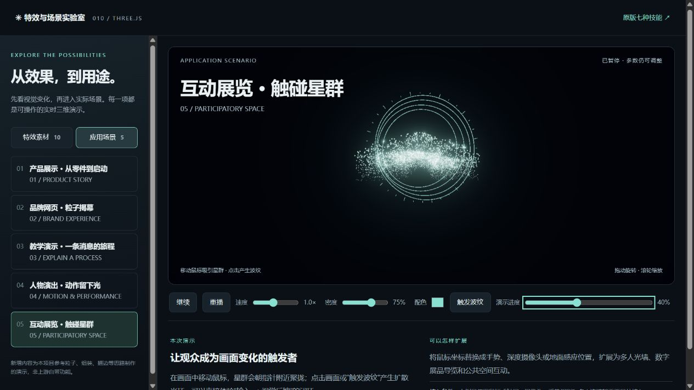
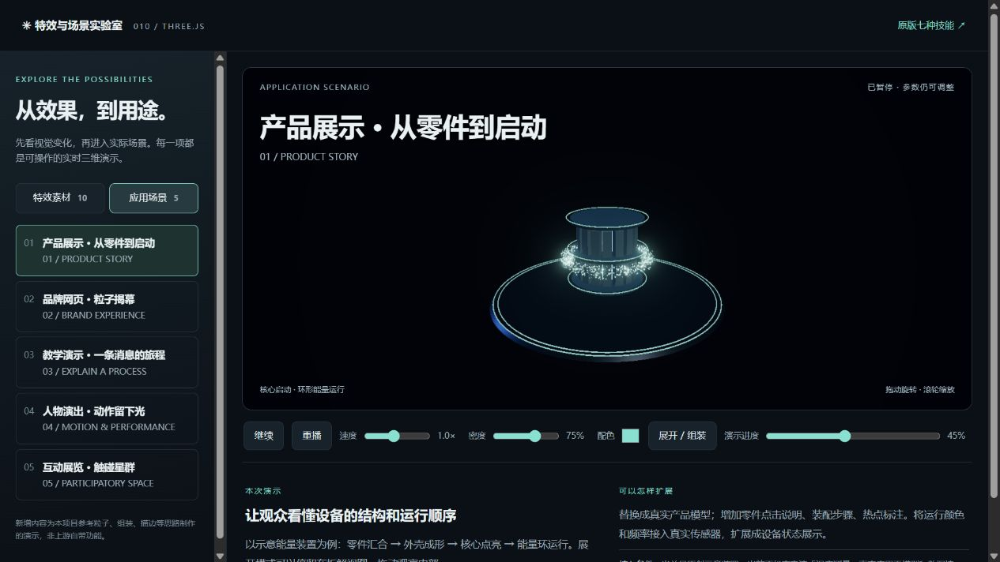
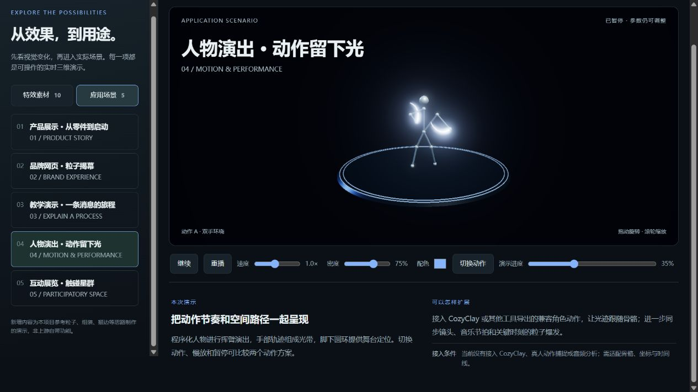

# 010 · LinearAbilityExtThreeJS

> Three.js 技能特效示例工程。保留原版技能，新增特效素材与非游戏应用场景，供体验和按需参考。

| 项目 | 内容 |
| --- | --- |
| 原始仓库 | [achrefelouafi/LinearAbilityExtThreeJS](https://github.com/achrefelouafi/LinearAbilityExtThreeJS) |
| 研究版本 | `bf58757ab9b6057515470aa074cdb4026bc54ed7` |
| 研究日期 | 2026-09-07 |
| 状态 | 已完成（能力整理、效果截图与场景演示） |
| 技术栈 | Three.js、GLSL、Vite、lil-gui |
| 许可 | 上游代码 MIT；角色、HDR 与纹理保留各自许可 |
| 上游源码 | `../../upstream/linear-ability-threejs`，不纳入研究仓库提交 |
| 中文体验页 | [打开演示](https://yydshly.github.io/0907_codex_project/demos/010-linear-ability-threejs/) |
| 原版界面 | [打开原版](http://127.0.0.1:5190/) |

## 实际效果预览

[](https://yydshly.github.io/0907_codex_project/demos/010-linear-ability-threejs/#exhibition)





2026-09-07 本机运行本项目新增演示后截取，非官方宣传图。点击首图进入动态实验室；[截图来源与帧位置](assets/README.md)。在线版提供新增特效和场景，原版游戏技能需按下文在本地启动。

## 新增特效与应用场景

[进入实验室](https://yydshly.github.io/0907_codex_project/demos/010-linear-ability-threejs/)。左侧切换“特效素材”和“应用场景”；每个条目提供用途、扩展方向和接入条件。原版七种技能在右上角独立入口。

10 个新增特效：萤火微光、飘雪、花瓣、庆祝彩纸、能量与数据流、零件聚合、文字粒子化、空间扫描、动作光迹、空间光环。

| 场景与入口 | 本次可操作内容 | 后续接入方向 |
| --- | --- | --- |
| [产品展示](https://yydshly.github.io/0907_codex_project/demos/010-linear-ability-threejs/#product) | 零件聚合、核心启动、拆解视图 | 真实产品模型、零件热点、装配步骤、传感器数据 |
| [品牌网页](https://yydshly.github.io/0907_codex_project/demos/010-linear-ability-threejs/#brand) | NOVA 文字聚散、星尘揭幕 | 品牌图形、滚动进度、页面进入与退出事件 |
| [教学演示](https://yydshly.github.io/0907_codex_project/demos/010-linear-ability-threejs/#education) | 五个带标签节点、消息流转、正反向与逐帧讲解 | 业务流程、排队、延迟、重试等教学变量 |
| [人物演出](https://yydshly.github.io/0907_codex_project/demos/010-linear-ability-threejs/#performance) | 程序化人物、两种挥臂动作、手部光迹 | 兼容骨骼动作、CozyClay 镜头时间线、音乐节拍 |
| [互动展览](https://yydshly.github.io/0907_codex_project/demos/010-linear-ability-threejs/#exhibition) | 指针吸引粒子、点击与按钮触发波纹 | 手势输入、空间感应、多用户位置 |

公共操作：播放/暂停、重播、速度、粒子密度、配色和演示进度。拖动进度自动暂停，暂停后改参数仍更新。扫描不使用粒子，密度控制在该示例禁用。每个效果还有一个专用操作，例如展开/组装、切换动作或反转流向。

这些是本项目原创概念演示，参考上游的程序化形状、粒子与阶段编排思路；不是上游已包含的产品能力。新增人物为关节示意模型；没有声称接入真实设备、动作捕捉、CozyClay 或摄像头。

实现：环境粒子和文字聚散在顶点着色器中按时间计算；动作与消息轨迹由 CPU 更新点坐标；零件按阶段插值，扫描使用透光平面与轮廓；统一 Three.js 场景、OrbitControls 和辉光后处理。切换时释放上一场景几何与材质。

新增多入口生产构建：在 `upstream/linear-ability-threejs` 中执行：

```powershell
node node_modules/vite/bin/vite.js build --config vite.showcase.config.js
```

输出包含实验室、原版技能体验页和原始场景。新增内容没有外部素材或服务依赖。

## 原版技能

[原版技能体验页](http://127.0.0.1:5190/skills.html)左侧点击七种技能，右侧直接运行对应效果。默认每次选择都会清空上一效果并恢复播放，方便单独观察；预览模式重置所选技能冷却，并通过原版施法事件在前方 8 米处释放。勾选“自己瞄准”可体验原版范围提示与手动释放。

| 技能 | 观察重点 |
| --- | --- |
| 火焰冠 Q | 环形火刃、熔融裂纹与上升余烬 |
| 深海触手 E | 程序化触手弯曲、交错砸地与粒子 |
| 电能球 R | 悬浮球体、电弧与底座 |
| 地裂石塔 F | 直线传播、地面碎裂与石塔升起 |
| 翠绿石门 V | 石块逐层拼装与门内发光 |
| 潮汐圆环 X | 地面拼装、翻转立起与环内效果 |
| 火焰传送门 Z | 火星描边、黑色圆面与环形粒子 |

另有电能 B、魔法 M、火焰 K 三种角色增益。P 暂停/继续，G 打开调参面板，C 清空。快捷键在场景获得焦点后使用，中文按钮可直接操作。右键拖动旋转视角，滚轮缩放。

## 运行与复现

在工作区根目录执行：

```powershell
powershell -NoProfile -File projects/010-linear-ability-threejs/start.ps1
```

本地实验室：[http://127.0.0.1:5190/showcase.html](http://127.0.0.1:5190/showcase.html)。Node.js 需满足上游 Vite 8 的要求（20.19+ 或 22.12+）；使用 npm 按上游 lockfile 安装。

生成 GitHub Pages 静态发布文件：

```powershell
powershell -NoProfile -File projects/010-linear-ability-threejs/build-publish.ps1
```

发布结果位于 `docs/demos/010-linear-ability-threejs/`，只包含本项目新增场景及 Three.js 依赖，不分发上游角色、HDR 和纹理。[第三方来源说明](demo/THIRD_PARTY_NOTICES.md)。推送 `main` 后由现有 GitHub Pages 配置发布。

启动器首次获取固定版本并安装依赖，将演示 HTML、样式、脚本和构建配置同步到上游根目录，再启动仅监听本机的 5190 服务。端口被占用时保留已有进程。日志存于本子项目，已由工作区忽略规则排除。

需要 Node.js 与 npm。关闭后重新运行启动器即可；演示依赖本地服务，不能直接双击 HTML 使用。原版特效、角色与编辑器均使用上游实现，原版技能的中文栏只是演示入口；新增实验室使用独立的 Three.js 场景与着色器，没有改写上游技能着色器。

## 验证与边界

- 依赖安装及生产构建通过。
- 独立静态发布构建通过；已从本地静态服务器打开发布目录，确认场景加载和导航使用相对资源路径，检查页无 JavaScript error。
- 新版三个入口的生产构建通过，包含实验室、技能体验页和上游原始页面；新增脚本语法检查通过。
- 新版浏览器检查：产品场景加载、品牌文字在 50% 进度暂停聚合、扫描轮廓、人物光迹、教学节点标签、互动波纹与花瓣画面均实际显示。检查页未记录 JavaScript error；不代表跨设备性能验收。
- 浏览器已加载真实场景，逐项触发七种技能入口，确认火焰冠与石门可见；三种增益触发返回对应提示，暂停与调参面板可切换。没有逐帧验收每种技能的完整生命周期。
- 中文体验页默认收起原版编辑器与重复技能栏，窄屏将操作区限制为可滚动区域，保留场景显示空间；原版独立入口保持原样。
- 本次不做设备性能排名或完整上游功能验收。
- 这是视觉效果沙盒，没有完整战斗系统；门的视觉效果不等于可传送。
- 地面以平面为基础，复杂地形需要适配。

## 当前判断

主要作为 Three.js 特效示例参考。有类似视觉需求时拆取代码；已增加场景演示，暂不进行通用 SDK、AI 编辑器或游戏系统扩展。

[返回总索引](../../README.md)
