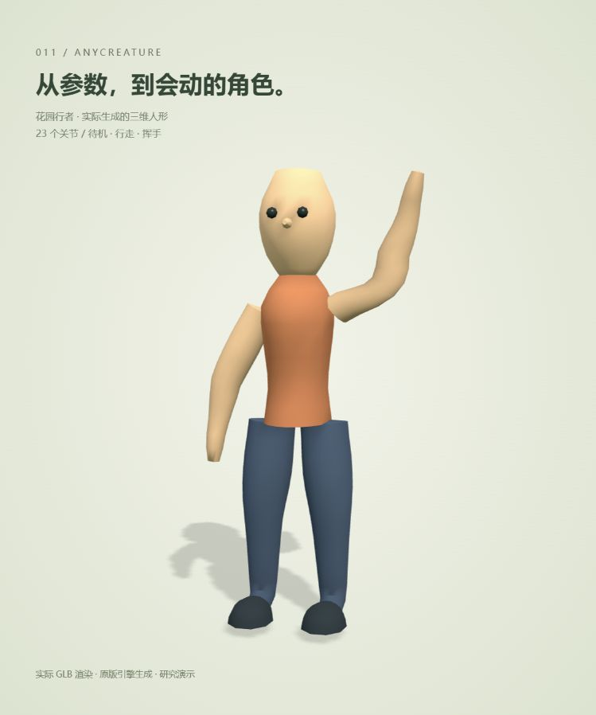

# 011 · anyCreature

> 把结构化角色描述编译成带骨骼与动画的三维资源，再接入网页或其他系统。

实际效果图：本研究从零设计的“花园行者”，由原版 anyCreature 生成 GLB，在 Three.js 中渲染；不是概念图或 AI 生图。点击图片进入交互演示。

| 项目 | 内容 |
| --- | --- |
| 上游仓库 | [Ariescar/anyCreature](https://github.com/Ariescar/anyCreature) |
| 研究版本 | 1.2.0 / ab5b1ce5c13e632f00f7f7cbfdb7a746e315000d |
| 日期 | 2026-09-07 |
| 状态 | 已完成（源码、18 份模型编译及浏览器实测） |
| 在线演示 | [生物制造实验室](https://yydshly.github.io/0907_codex_project/demos/011-anycreature/) |
| 许可证 | [上游 MIT](demo/assets/ANYCREATURE-LICENSE.txt) · [来源说明](demo/THIRD_PARTY_NOTICES.md) |

## 核心能力

外部大模型编写 JSON，定义骨架、身体截面、部件、材质和关节关键帧。引擎生成网格、蒙皮、顶点颜色、环境遮蔽与动画，导出 GLB。查看器负责显示，库的主要价值在于生成可以修改、下载和复用的三维资产。

导出的 GLB 可作为资源接入支持它的三维网页、游戏或编辑系统；仍需验证目标系统的材质、骨骼和动画兼容。库不会自动提供场景、行为 AI 或完整物理模拟。

## 实际演示

| 角色 | 来源 | 模型内动作 |
| --- | --- | --- |
| 花园行者 | 从空白描述生成简化人形，23 关节 | 待机、行走、单手挥手 |
| 蓝金蝴蝶 | 从空白描述生成膜状前后翅，53 关节 | 舒缓开合、振翅 |
| 苔灯蜗牛 | 从空白描述生成腹足、螺壳与触角，14 关节 | 待机、原地爬行 |
| 原野狼、冰原狼、弯角兽 | 官方狼及配色/弯角变体 | 待机、行走 |

六种外观各有三档实际编译的躯干体型，共 18 份 JSON 与 GLB。可以暂停、继续、重播、调速、拖动动作进度、查看线框和骨骼，并下载当前体型的模型与参数。

花园、花朵、步道及沿路线移动由本研究新增的 Three.js 场景控制。模型内的振翅、行走与挥手由 anyCreature 编译，随 GLB 下载；花园和路线保存在网页代码中，不随角色 GLB 下载。

## 已验证与边界

- 18 份模型通过原版引擎构建检查；正常/错误校准样例能够被区分。
- 浏览器实际检查独立角色的外观、动画、体型切换、暂停/进度与场景运动。
- 页面播放本次生成的成果，不提供即时输入文字生成模型的服务。
- 人形是低面数原型，没有精细手指、表情、头发或服装系统；步态不等同动捕。
- 完整工作流中的独立 AI 视觉评审、攻击动画、游戏引擎适配和物理模拟尚未验收。
- 引擎检查含作者的风格偏好，不能全部当作通用几何标准。部分蜗牛截面保留非阻断警告，详见实测记录。

## 对我们的意义

可补充三维角色原型来源，服务于 Three.js 网页、互动演示和场景预演；与 CozyClay 衔接仍需验证导入与骨架兼容。最值得借鉴的是“结构化描述 → 程序生成 → 检查 → 修正 → 资源交付”的流程。

## 资料

- [构建与运行](demo/README.md)
- [人形生成实测](notes/human.md)
- [动画、体型与花园实测](notes/motion-and-scene.md)
- [蜗牛从零生成记录](notes/from-scratch.md)
- [早期样例校准](notes/verification.md)
- [实际效果图来源](assets/README.md)
- [返回总索引](../../README.md)
