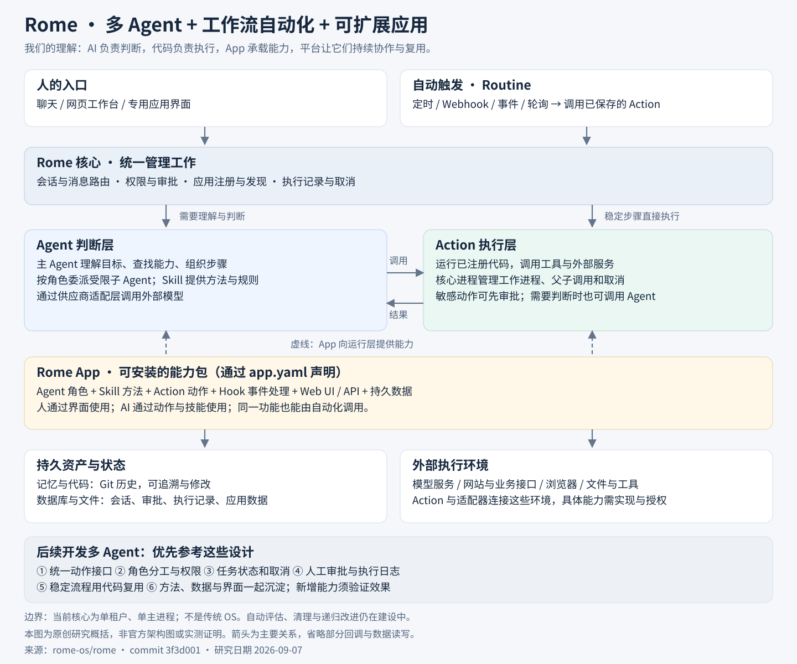

# 012 · Rome

> 多 Agent + 工作流自动化 + 可扩展应用的一体化平台。后续开发多 Agent 时，重点参考能力封装、执行管理和持久状态。

| 项目 | 内容 |
| --- | --- |
| 原始仓库 | [rome-os/rome](https://github.com/rome-os/rome) |
| 研究版本 | [`3f3d001d90bdad2e3a5298fb524fc74e96419d57`](https://github.com/rome-os/rome/tree/3f3d001d90bdad2e3a5298fb524fc74e96419d57) |
| 研究日期 | 2026-09-07 |
| 状态 | 已完成（架构理解与源码核对；未部署实测） |
| 技术栈 | TypeScript / Node.js、React、Action 工作进程、SQLite 默认存储、Git |
| 上游许可证 | [MIT](https://github.com/rome-os/rome/blob/3f3d001d90bdad2e3a5298fb524fc74e96419d57/LICENSE) |
| 后续定位 | 多 Agent 开发架构参考，暂不整套接入 |

## 整体架构图

[打开原始矢量图](assets/rome-architecture.svg) · [图片说明](assets/README.md)

本图为基于源码与官方概念文档的原创研究概括，非官方架构图、产品截图或实测证明。实线表示主要触发、调用或关联关系；虚线表示 App 提供能力。为便于理解，省略回调、具体存储读写与部分内部模块。

## 我们确认的理解

Rome 从产品形态看，是支持多 Agent 的应用平台；“Agent OS”是对管理任务、工具、数据与应用环境的定位，不是传统操作系统。多 Agent 是一项机制，核心价值还包括把可重复的方法封装成代码和应用，供后续任务复用。

- **Agent 负责判断：** 理解目标、选择工具、组织步骤，按角色委派受限子 Agent。
- **Skill 提供方法：** 把经验与规则加载到模型上下文，并不直接执行代码。
- **Action 负责执行：** 注册成统一动作，供 Agent、应用和自动化调用。纯代码步骤可以不调用模型；Action 内仍可调用 Agent。
- **Routine 负责触发：** 将时间或事件绑定到一个动作及其参数。
- **App 承载能力：** 按清单组织角色、技能、动作、事件处理、界面、接口与数据。人操作界面，AI 调用能力。
- **平台管理过程：** 会话、审批、执行记录、取消与数据持久化统一组织，能力查找与应用安装有共同入口。

与前面研究的 Grok Bot 方向相近，都是持续执行任务的 AI 工作环境。这里主要参考 Rome 如何把成果组织成可复用的应用能力；不据此认定其他产品缺少相同功能。此前的 Awesome Grok Bot 仓库是资料与案例目录，Rome 仓库则包含实际平台实现。

## 后续开发多 Agent 的参考重点

| 设计 | 对我们的意义 |
| --- | --- |
| 统一 Action 接口 | 人的按钮、Agent 调用、定时执行复用一套功能；明确输入、结果、错误和审批状态 |
| 角色与能力边界 | 按任务需要分工，限定子 Agent 能调用的功能；不以 Agent 数量作为能力指标 |
| 显式任务状态 | 区分执行中、等待审批、成功、失败和取消；明确父子任务与独立任务的生命周期 |
| 执行记录与人工介入 | 能查清谁触发、调用了什么、产生什么结果；高影响动作支持预览和审批 |
| 代码流程与模型判断分离 | 稳定步骤沉淀为代码，复杂判断使用模型，减少重复探索；收益需要实测 |
| 记忆与业务数据分离 | 偏好、知识、项目背景与会话、任务状态、业务记录分别管理 |
| 应用作为复用单元 | 不只保存提示词，还保存界面、代码、数据结构与调用约定 |
| 能力质量检查（建议补充） | 用样本与验收标准判断新能力是否有效，再考虑版本治理与过期清理 |

可验证的首个场景：输入 GitHub 仓库地址 → 获取版本与说明 → 分析源码证据 → 保存研究记录 → 在项目界面查询与比较。评估第二次是否复用已有能力、结论是否可追溯、耗时与人工修正量是否改善。此场景是我们的开发建议，尚未实现。

## 能力边界

- “成长”主要来自保存或修改代码、技能与记忆，不是训练底层模型。已有 Dream 复盘机制，但复盘不等于质量已经提高。
- 官方将持续固化能力组合、评估改进效果、清理重复与过时能力等列为后续方向，不能作为成熟功能承诺。
- 当前每个主机与 profile 对应一个核心进程，单租户、无集群选主。工作进程用于执行动作，不代表多主高可用系统。
- 动作记录和重放机制不等于任意外部副作用都能安全恢复；开发时仍需设计幂等、重试与失败处理。
- 本次仅核对文档和关键源码，未安装运行、未做性能、安全或长任务可靠性验证。

## 源码依据

以下链接固定到本次研究版本，方便后期开发时回查。

| 关注点 | 依据 |
| --- | --- |
| App 清单与扩展机制 | [apps.md](https://github.com/rome-os/rome/blob/3f3d001d90bdad2e3a5298fb524fc74e96419d57/docs/concepts/apps.md) |
| Agent 与角色约束 | [agents.md](https://github.com/rome-os/rome/blob/3f3d001d90bdad2e3a5298fb524fc74e96419d57/docs/concepts/agents.md) |
| 动作、审批与执行状态 | [actions.md](https://github.com/rome-os/rome/blob/3f3d001d90bdad2e3a5298fb524fc74e96419d57/docs/concepts/actions.md) |
| 能力搜索与执行入口 | [mcp-facade.ts](https://github.com/rome-os/rome/blob/3f3d001d90bdad2e3a5298fb524fc74e96419d57/packages/core/src/core/mcp-facade.ts) |
| 执行引擎 | [engine.ts](https://github.com/rome-os/rome/blob/3f3d001d90bdad2e3a5298fb524fc74e96419d57/packages/core/src/actions/engine.ts) |
| 工作进程与内部通信 | [api.md](https://github.com/rome-os/rome/blob/3f3d001d90bdad2e3a5298fb524fc74e96419d57/docs/architecture/api.md) |
| 记忆、自动化与数据库 | [data.md](https://github.com/rome-os/rome/blob/3f3d001d90bdad2e3a5298fb524fc74e96419d57/docs/concepts/data.md) |
| 单租户与进程边界 | [process.md](https://github.com/rome-os/rome/blob/3f3d001d90bdad2e3a5298fb524fc74e96419d57/docs/architecture/process.md) |
| 现状与递归改进愿景 | [VISION.md](https://github.com/rome-os/rome/blob/3f3d001d90bdad2e3a5298fb524fc74e96419d57/VISION.md) |

[返回总索引](../../README.md)
