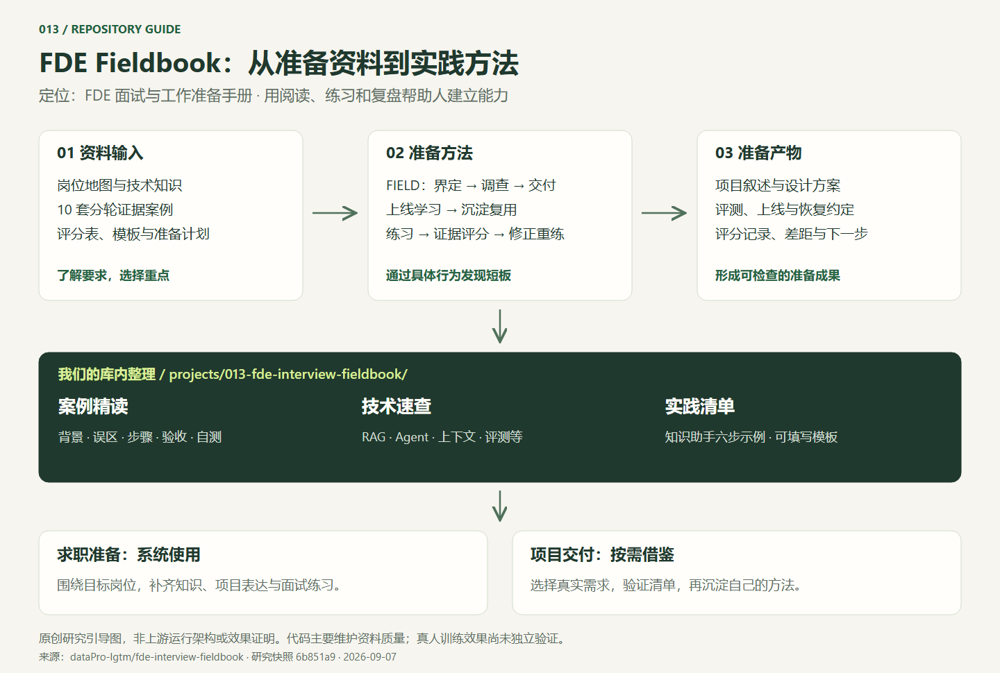

# 013 · FDE Interview Fieldbook

> 面向 FDE 岗位的面试与工作准备资料库，提供知识、方法、案例、评分表和学习计划。

| 项目 | 内容 |
| --- | --- |
| 上游仓库 | [dataPro-lgtm/fde-interview-fieldbook](https://github.com/dataPro-lgtm/fde-interview-fieldbook) |
| 研究版本 | 1.0.0-rc.1 / `6b851a901364b0ba0dd7ab2edf0390de79c9aa0c` |
| 日期 | 2026-09-07 |
| 状态 | 已完成（资料、方法与价值整理；训练效果未实测） |
| 上游许可证 | [MIT](https://github.com/dataPro-lgtm/fde-interview-fieldbook/blob/6b851a901364b0ba0dd7ab2edf0390de79c9aa0c/LICENSE) |
| 我们的库路径 | `0907_codex_project/projects/013-fde-interview-fieldbook/` |
| 网页 | [中文案例与技术导览](https://yydshly.github.io/0907_codex_project/demos/013-fde-interview-fieldbook/) |

原创研究引导图，非上游运行架构或效果证明。[查看矢量图](assets/fde-overview.svg) · [图源说明](assets/README.md)

## 核心认识

它是岗位准备与实践手册。核心内容包括岗位认知、技术知识、10 套案例、评分与复盘、7/14/30 天计划以及现场交付模板。代码主要检查资料完整性、来源时效与内容一致性，不提供可直接集成的 RAG、Agent 或业务运行服务。

FIELD 方法依次关注界定任务、调查事实、最小端到端交付、上线学习与沉淀复用。训练通过分轮证据、压力情境、行为评分与重练，让使用者发现判断中的短板。

## 对我们的价值

- 准备 FDE 或相近岗位时，可以系统使用资料和计划。
- 做企业 AI 项目时，选择性参考需求、验收、事故和交接清单。
- 当前定位为按需参考的知识与方法资产；没有具体需求时，深入研究和整套接入优先级较低。
- AI 教练、可运行故障实验和训练平台属于未来需另外开发的方向，并非上游已有功能。

## 验证边界

本次阅读上游目录、现场手册、评分表、案例、学习路径、维护脚本和发布审计，未运行上游完整验收。上游审计记录的独立学员、独立主持、评分校准和双语使用四项验证均为 `not-run`；不能据此宣称训练或录用效果已获证明。

## 网页说明

原创静态中文研究导览。十套案例均可在本页阅读背景、误区、处理步骤、技术解释、验收证据、参考产物和自测，不必先跳到上游。六组技术速查涵盖 RAG、工作流与 Agent、上下文与 Skill、MCP/A2A、评测观测、成本延迟；另有一个知识助手的六步实践示例。

页面标明我们的子项目仓库路径，并提供以下库内笔记的下载副本。仓库入口关联本子项目，网页和笔记随研究库统一发布。外部证据链接固定到研究提交。网页不加载外部字体、库或模型服务。

案例支持固定链接、刷新恢复、浏览器后退和前后切换；默认案例与来源链接在禁用脚本时仍可阅读。网页检查与修复详情见运行说明。

- [十套案例与技术实践笔记](notes/practice-guide.md)
- [可填写的项目实践清单](notes/project-checklist.md)
- [网页源码](demo/index.html)
- [运行与验证说明](demo/README.md)
- [上游发布审计](https://github.com/dataPro-lgtm/fde-interview-fieldbook/blob/6b851a901364b0ba0dd7ab2edf0390de79c9aa0c/docs/research/release-validation-1.0.md)
- [返回总索引](../../README.md)
