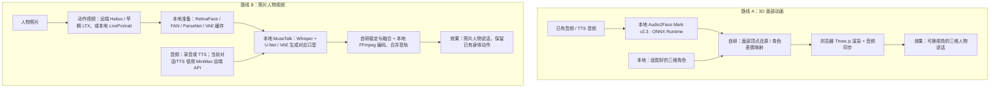

# 015 · 从声音到数字人物：3D 与视频两条路线

**3D 路线：音频驱动已适配的三维人物面部，再由渲染器显示口型与表情。** 
**视频路线：照片先生成动作视频，再根据音频重绘口型，合成最终说话视频。**

本项目从 [NVIDIA Audio2Face-3D](https://github.com/NVIDIA/Audio2Face-3D) 研究起步，进一步集成照片人物、动作视频、对话、语音和口型。照片视频使用 MuseTalk，不属于 Audio2Face 的照片生成能力。

**[打开公开效果导览](https://yydshly.github.io/0907_codex_project/demos/015-audio2face-3d/)** · **[完整实施图](https://yydshly.github.io/0907_codex_project/demos/015-audio2face-3d/implementation-guide.html)** · **[以后重读与维护](notes/START-HERE.md)**

## 先看实际效果

- **[约 20 秒网页演示录像](https://yydshly.github.io/0907_codex_project/demos/015-audio2face-3d/media/showcase-8020.mp4)**：真实录制本地 8020 页的原照片、原动作、三段说话和待机切换；声音按播放器时钟对齐原片音轨。不是实时生成过程。
- **[三段原始成片合集](https://yydshly.github.io/0907_codex_project/demos/015-audio2face-3d/media/performance-clips.mp4)**：直接观察口型、身体动作和句尾效果。
- **[三维 Mark 交互演示](https://yydshly.github.io/0907_codex_project/demos/015-audio2face-3d/mark.html)**：播放实际 Audio2Face 输出，旋转、缩放和查看线框。公开页回放已有样例，上传推理需本地服务。

录像角色是原创 AI 虚构成年女性。**该录像实际使用 LTX-Video + Edge TTS + MuseTalk 1.5**；后续 8022 工作台才接入 MiniMax 对话、TTS 和 Hailuo 动作准备。公开站点不包含仅限本机评估的 Camila 角色或其画面。

## 整体架构

两条路线互相独立，可以共用对话与语音服务。3D 路线的身体动作需要骨骼动画系统；视频路线的身体动作来自有限素材，MuseTalk 负责嘴型。RetinaFace / FAN / ParseNet 和缓存属于我们的口型准备层，不是 LivePortrait 的核心动画原理。

## 组件与当前部署

| 组件 | 在项目中的能力 | 当前部署 |
|---|---|---|
| Audio2Face-3D Mark v2.3 | 音频 → 三维面部动画系数 | 本地 ONNX Runtime，CUDA / CPU |
| Three.js | 三维角色、材质、面部动画显示 | 浏览器本地 |
| LivePortrait | 照片的头部、眼神和表情动作 | 本地模型 |
| LTX-Video | 早期半身动作视频 | 远端 Hugging Face Space；素材下载复用 |
| MiniMax Hailuo | 当前自然半身动作视频 | 远端 API |
| MiniMax 对话 / TTS | 回复、情绪类别和声音 | 远端 API |
| MuseTalk 1.5 | 音频驱动口型重绘 | 本地模型 |
| RetinaFace / FAN / ParseNet | 检测、对齐、分割，来自 facexlib | 本地辅助模型 |
| OpenCV / NumPy / SciPy / FFmpeg | 稳定、融合与音视频处理 | 本地程序 |
| 自研 Python / JavaScript | 人物、缓存、任务、对话与播放器 | 本地前后端 |

Whisper / VAE / U-Net 是 MuseTalk 使用的模型组件。ImageGen 用于开发时制作示例人物；用户上传照片后并不需要调用它。现有权重做推理，没有按每个人物重新训练。

## 本地使用与复现边界

本机已验证环境：Windows、RTX 4070 Laptop 8GB、Python 3.10。公开网站只回放结果；新台词、上传人物和模型推理依赖本地环境与云服务配置。

| 本地入口 | 用途 | 已准备环境下启动 |
|---|---|---|
| 8015 | Mark / Camila 三维面部演示 | `./start.ps1` |
| 8020 | 已保存的动作、语音、口型效果 | `./start-complete.ps1` |
| 8022 | 人物上传、对话、口型与新台词 | `./start-performance.ps1` |
| 8022/effects.html | 本地完整效果总览 | 与 8022 共用服务 |

首次准备：

1. 3D 路线参见 [scripts/setup.ps1](scripts/setup.ps1)，获取固定版本的上游代码、ONNX 权重和 Mark 几何。Camila 只用于本地评估，参见 [重读手册](notes/START-HERE.md)。
2. 视频路线需要 MuseTalk 代码与权重、facexlib 辅助权重及 PyTorch/CUDA 环境；选择本地面部动作时再准备 LivePortrait。入口见 [完整指引](https://yydshly.github.io/0907_codex_project/demos/015-audio2face-3d/implementation-guide.html#reproduce) 和 `scripts/*requirements.txt`、模型下载脚本。
3. 从 [.env.companion.example](.env.companion.example) 创建本机配置；密钥只留在后端。配置共享文件时使用自己的路径。
4. 先回放已有资源，再生成新台词。Git 不包含全部本地模型与人物缓存，代码快照不是空白机器一键安装包。

## 已实现与仍待验证

已实现：真实本地 3D 模型推理、照片人物准备、MiniMax 对话/TTS、MuseTalk 新口型、时序稳定、句尾回落和分段播放。自然半身版完成一个人物的六种动作及同音频比较；第二人物当时遇到供应商额度限制，未完成质量验证。

尚未完成：任意照片质量保证、无限连续身体表演、语义级手势、无缝情绪切换、实时视频通话、麦克风输入、3D 完整身体动作。模型推理耗时不等于完整响应延迟。

历史 JSON 审计可能含本地会话内容，默认不发布。公开发布检查与录屏说明见 [发布记录](notes/public-release.md)，模型版本见 [依赖索引](notes/revisit-inventory.json)。

## 以后怎么重新理解

优先阅读 [后续分析索引：能力—页面—代码—复现](notes/REVIEW-MAP.md)，再进入下面的专题。

- [START-HERE：重读、关键选择、代码地图、恢复与排查](notes/START-HERE.md)
- [组件架构与归属](notes/component-architecture.md)
- [自然半身流程与限制](notes/natural-body-v2.md)
- [自助上传人物流程](notes/user-avatars-v1.md)
- [原始完整视频链路记录](notes/complete-results.md)
- [嘴部稳定](notes/mouth-stability.md)、[蒙版修正](notes/mouth-mask-fix.md)、[句尾处理](notes/speech-tail-fix.md)

历史笔记中的“最新”“未接入”“未发布”对应记录当时状态；以本 README 与发布记录区分公开展示、当前本地系统和早期实验。

## 来源与发布范围

保留上游代码、权重、资产各自的许可归属，参见 [第三方说明](demo/THIRD_PARTY_NOTICES.md)。本项目是独立集成，不代表 NVIDIA、MiniMax 或其他提供方的官方产品。

静态发布采用 [显式发布清单脚本](scripts/publish_static.py)，只包含说明、Mark 样例及选定的虚构人物录像。没有发布密钥、用户上传、对话记录、模型权重或 Camila 资产。
