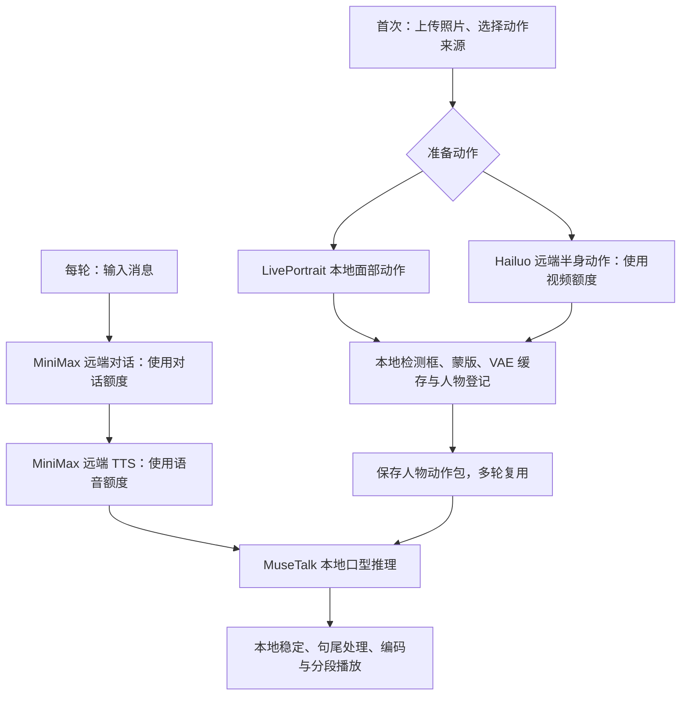

# 后续分析入口：能力、页面、代码与复现

状态记录：2026-09-08。本文是当前集成的阅读索引，不是上游模型能力承诺。先看本表，再按问题进入专题；历史实验记录中的“最新”只代表记录当时。

## 1. 页面与能力对应表

以下本地路径以 `http://127.0.0.1:8022` 为根；在项目目录用 `./start-performance.ps1` 启动已有环境。

| 能力 | 本地页面 | 远端保留形式 | 主要代码 |
|---|---|---|---|
| 选择 / 上传人物 | `/characters` | [人物选择页](https://yydshly.github.io/0907_codex_project/demos/015-audio2face-3d/characters.html)：预设选择可用，上传禁用 | [characters.js](../demo/characters.js)、[avatar_service.py](../scripts/avatar_service.py)、[prepare_user_avatar.py](../scripts/prepare_user_avatar.py) |
| 上下文对话 | `/chat?avatar=人物ID` | [对话页](https://yydshly.github.io/0907_codex_project/demos/015-audio2face-3d/chat.html)：保留原界面，发送禁用，可播已有片段 | [dialogue_service.py](../scripts/dialogue_service.py)、[minimax_dialogue.py](../scripts/minimax_dialogue.py)、[dialogue-segmented.js](../demo/dialogue-segmented.js) |
| 六种动作 / 指定台词 | `/?avatar=人物ID` | [动作回放](https://yydshly.github.io/0907_codex_project/demos/015-audio2face-3d/experience.html)：十二段动作与已有成片 | [performance.js](../demo/performance.js)、[performance_worker.py](../scripts/performance_worker.py) |
| 半身优化对照 | `/body-comparison.html` | [同音频对照](https://yydshly.github.io/0907_codex_project/demos/015-audio2face-3d/body-comparison.html) | [build_body_assets.py](../scripts/build_body_assets.py)、[natural-body-v2.md](natural-body-v2.md) |
| 完整演出、句尾优化 | 8020，`./start-complete.ps1` | [四种模式回放](https://yydshly.github.io/0907_codex_project/demos/015-audio2face-3d/complete.html) | [complete-v5.js](../demo/complete-v5.js)、[speech-tail-fix.md](speech-tail-fix.md) |
| 3D 面部 | 8015，`./start.ps1` | [Mark 三维交互](https://yydshly.github.io/0907_codex_project/demos/015-audio2face-3d/mark.html)，Camila 仅本地评估 | [inference.py](../scripts/inference.py)、[retarget.py](../scripts/retarget.py)、[app.js](../demo/app.js) |
| 全部成果与原理 | `/effects.html`、`/implementation-guide.html` | [效果与架构首页](https://yydshly.github.io/0907_codex_project/demos/015-audio2face-3d/) | [build_public_sections.py](../scripts/build_public_sections.py)、[build_experience.py](../scripts/build_experience.py) |

当前优先看 8022 对话 / 工作台、8020 接受版本和半身对照。8017 照片口播、8018 伙伴原型、8019 动作探索、8021 基线、`/chat-classic` 整段对话均作为历史参考，入口集中在本地总览。不要同时启动所有历史服务来判断当前系统。

## 2. 一次准备与每轮对话，分别发生什么

- 六种动作工作台输入的是“人物要说的台词”，通常跳过对话模型组织回复；聊天页输入的是“用户消息”。
- 人物准备不是重新训练；每句也不是重新调用 Hailuo 生成身体动作。选择已有素材后，口型仍须根据新音频推理。
- 当前新人物默认准备六种动作，因此尝试多个半身人物可能较快使用视频额度。少量动作先验收、按需补齐尚未落实。
- 3D 是独立路线：音频 → Audio2Face → 面部还原 / 适配 → Three.js；不经过 MuseTalk。当前 3D 演示没有完整聊天与身体骨骼链路。
- 额度价格、可用量与服务状态需执行时确认。这里不估算实时费用，也不把取消本地任务等同于撤销云端计费。

## 3. 恢复与验证顺序

参考环境为 Windows、Python 3.10、RTX 4070 Laptop 8GB；这是已验证机器，不能视为通用最低配置。依赖清单见 [revisit-inventory.json](revisit-inventory.json)，恢复步骤见 [START-HERE 第 8 节](START-HERE.md#8-以后重启与恢复先做什么)。

1. 保存代码版本，检查 `vendor/` 模型、FFmpeg、Python 环境与所选人物素材；只 clone Git 不能恢复全部运行数据。
2. 配置后端 `.env.companion` 或其共享配置引用，参考 [.env.companion.example](../.env.companion.example)。不把密钥写进页面或文档。
3. `./start-performance.ps1` 启动服务与模型进程。脚本依赖已有 `.cache/sadtalker-venv/Scripts/python.exe`；此目录名是历史遗留，当前口型核心是 MuseTalk。
4. 先检查 `/characters`、`/chat`、工作台能打开，已有片段能播放，人物选择能传递；这一步不发送生成请求。
5. 确认工作台模型就绪，再用已有音频验证本地推理；最后做一次短消息的完整生成，记录首句等待、总耗时和成片质量。不要只以页面可访问判断后端已完成。

故障优先查看 `.cache/performance-server-error.log`、`.cache/performance-worker-error.log`；视觉问题按 [START-HERE 第 9 节](START-HERE.md#9-出问题时按现象定位) 排查。

| 数据 | 位置 | 是否由公开 Git 完整恢复 |
|---|---|---|
| 上游、权重与部分资产 | `vendor/` | 否，需要重新获取并检查版本 / 许可 |
| 人物与动作缓存 | `.cache/avatars/`、内置 `.cache/performance/` | 否，需另外备份 |
| 对话及生成任务 | `.cache/dialogue-sessions/`、`.cache/performance-jobs/` | 否，可能含私人内容，不公开 |
| 已接受基线 | `.cache/complete/`、`.cache/releases/` | 不完整，公开站仅选择部分演示素材 |
| 公开展示 | 仓库 `docs/demos/015-audio2face-3d/` | 是，但不能代替完整模型运行环境 |

## 4. 下一轮分析应该验证什么

| 问题 | 目前边界 | 建议保留的证据 |
|---|---|---|
| 换人物是否通用 | 流程复用已实现；任意照片质量未证明 | 固定音频、固定动作模式，记录照片条件与各人物缺陷；自然半身第二人物还需完成验证 |
| 嘴部是否稳定 | 句尾修正改善既有样例，不保证所有输入 | 同音频优化前后成片、句尾静音帧、缓存 / 参数版本；见 [嘴部稳定](mouth-stability.md)、[句尾处理](speech-tail-fix.md) |
| 动作是否自然 | 片段有限，存在循环、接缝，非语义手势 | 原动作与口型成片并排观察，避免把动作源缺陷归到口型算法 |
| 延迟是否可用 | 异步生成、分段播放，不是实时通话 | 分别记录对话、TTS、GPU、编码、首句可播放与总耗时 |
| 是否可从零复现 | 当前启动脚本使用已准备环境 | 新环境恢复日志、模型版本、缺失步骤和实际耗时；尚未做新的完整冷启动验收 |

下一次先固定一组对照素材、明确验收项，再改变一个因素。不要通过不断生成新人物或新语音来替代受控比较。

## 5. 远端上线还有什么缺口

当前 GitHub Pages 提供静态页面留档和回放；人物选择会把预设 ID 带入静态对话页。没有部署上传处理、会话服务、MiniMax 服务端调用或 GPU 推理。

真正上线还需：应用 API 与服务端密钥配置、GPU 工作进程、人物 / 会话存储、任务队列与容量限制、用户访问与资源隔离、用量控制、故障恢复及数据删除策略。它们是部署与产品化工作，不能通过启用静态页面的发送按钮完成。

公开页由 [publish_static.py](../scripts/publish_static.py) 构建；保留本地模板，使用专门的静态交互脚本，避免公开页误调用本地 API。修改页面时同步维护构建脚本，勿只改生成后的 `docs/`。发布范围与录屏方式见 [public-release.md](public-release.md)。
