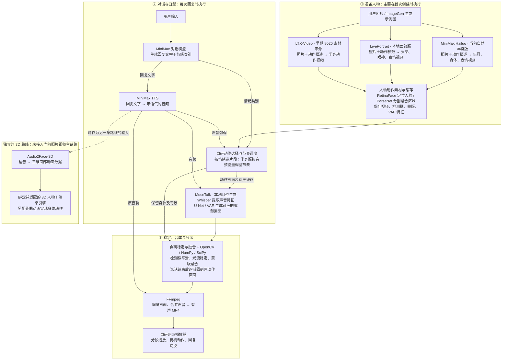

# 人物语音与动作系统：组件架构

根据本项目当前代码整理，2026-09-08。图中将历次方案放在同一能力图里；动作生成的三个分支是替代方案，不是依次执行。

## 读图说明

- MiniMax Hailuo、LivePortrait、LTX-Video 是不同的动作来源，不是三个模型叠加运行。8020 是先前生成结果的播放器；8022 提供人物准备、对话和新回复生成。
- ImageGen 属于开发期间制作示例图片的工具；用户上传照片后不必调用它。没有通过人物训练或 3D 建模来实现当前视频效果。
- MuseTalk 中的 Whisper 用来提取音频特征，此处不是负责识别用户说话。当前图的用户输入是文字。
- PyTorch / CUDA 承担本地模型运算，Diffusers / Transformers 等负责相关模型结构和加载；它们是执行基础，不是额外一种表演能力。
- 自研 Python 服务负责人物隔离、任务排队、缓存复用、取消与恢复；自研 JavaScript 负责播放器状态。开发用的浏览器操作和验证工具不参与最终视频生成。
- 身体动作先生成并缓存；每次回复调用对话和语音服务，再在本地生成嘴部画面、合成视频。静音回落保留原动作画面，不能保证源视频自身完全没有嘴部微动。
- SadTalker、Edge TTS 曾用于早期照片说话与语音验证；它们不在当前 MiniMax＋MuseTalk 主流程中。

## 关键代码对应

| 能力 | 项目文件 |
|---|---|
| MiniMax 半身动作 | scripts/minimax_motion.py、scripts/build_body_assets.py |
| LivePortrait 面部动作 | scripts/build_performance_assets.py |
| 早期 LTX 素材 | scripts/generate_motion.py |
| 人物与准备流程 | scripts/avatar_registry.py、scripts/avatar_service.py、scripts/prepare_user_avatar.py |
| 几何、蒙版、潜变量缓存 | scripts/prepare_performance_cache.py |
| MiniMax 对话与语音 | scripts/minimax_dialogue.py |
| MuseTalk 推理与任务调度 | scripts/performance_worker.py |
| 音频节奏与句尾回落 | scripts/speech_motion.py、scripts/avatar_timing.py |
| 稳定与合成 | scripts/performance_postprocess.py、scripts/stabilize_complete.py |
| 页面与分段播放 | demo/characters.js、demo/dialogue-segmented.js |

当前架构的复用点是“人物素材与缓存 → 同一套对话、口型、稳定、播放流程”。跨人物的画面质量仍需实测；视频素材循环和情绪切换也仍有接缝限制。

## 效果总览入口与运行位置

新增 http://127.0.0.1:8022/effects.html ，按视频人物和 3D 人物分类展示。视频区直接播放自然半身、本地面部、8020 已保存效果；3D 区嵌入 Camila 与 Mark 演示，可切换并独立打开。双列架构图在同页下方，说明两条链路的模型、输入输出与边界。

| 组件 | 本项目实际运行位置 |
|---|---|
| LivePortrait、MuseTalk、Whisper、RetinaFace、ParseNet | 本地模型 |
| Audio2Face Mark v2.3 / ONNX Runtime | 本地模型，本次状态检查为 CUDA + CPU provider |
| MiniMax Hailuo、对话模型、TTS | 远端 API |
| LTX-Video 早期动作素材 | 远端 Hugging Face Space 生成，下载到本地复用 |
| ImageGen 示例人物制作 | 远端开发工具，不是用户上传后每次运行的依赖 |
| OpenCV、NumPy、SciPy、FFmpeg、自研服务与播放器 | 本地程序 |
| Three.js | 浏览器本地三维渲染 |

这次只整理展示和导航，没有调用新的收费模型生成。旧页面新增总览入口，原媒体与生成逻辑保持现有行为。新增页面无需重启服务；已经打开的旧页需要刷新才能显示新增导航。

验证：15 个页面、视频、海报与样式链接返回 HTTP 200；浏览器查看了视频卡片、Camila / Mark 切换及双列架构图。详情见 effects-hub-verification.json。

## 组件归属补充

RetinaFace / FAN / ParseNet 是本项目通过 facexlib 使用的本地预处理模型，不是 LivePortrait 核心动画链路的名称。RetinaFace / FAN 在 LivePortrait 输入准备和 MuseTalk 输入准备中均被复用。ParseNet 输出语义区域，最终融合蒙版还由本项目限定下半脸、羽化边缘与平滑。

`prepare_performance_cache.py` 为 MuseTalk 准备动作视频检测框、蒙版和 VAE 潜变量；此过程独立于动作视频来自 LivePortrait、Hailuo 或早期 LTX。VAE 来自 MuseTalk 使用的模型组件，本项目改为确定性编码并持久化，缓存不是重新训练人物模型。

LivePortrait 本体是外观/运动提取、隐式关键点驱动、特征变形、解码，以及 stitching / retargeting 控制；本项目另外编排动作参数曲线。
